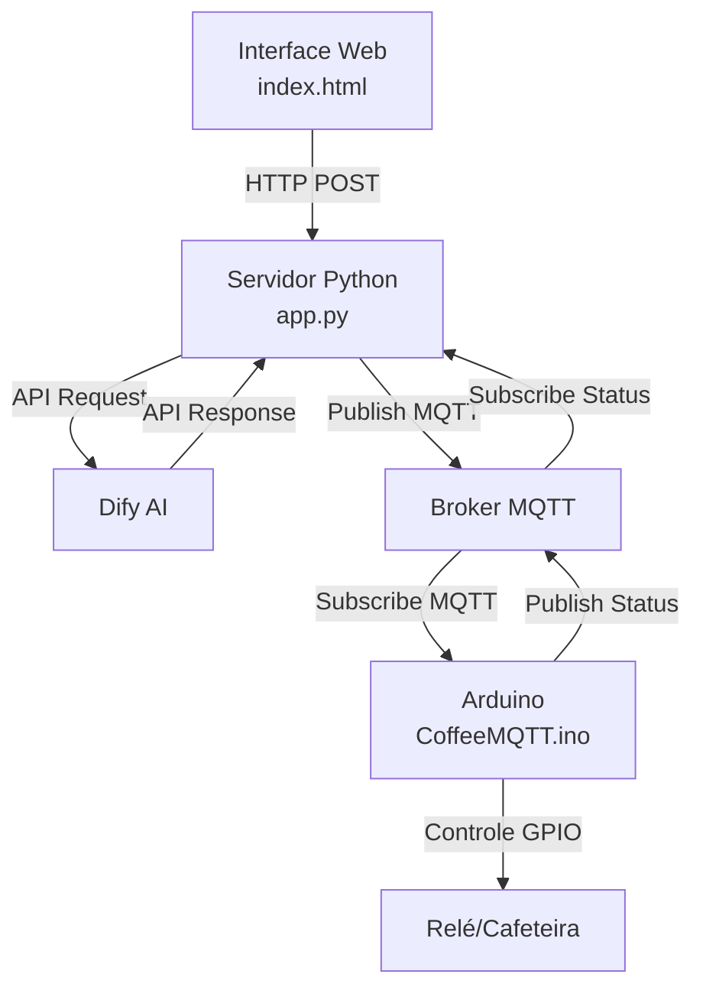

# CoffeeAI Control - Documentação Técnica

## 1. Visão Geral
O CoffeeAI Control é um sistema inteligente de controle de cafeteira que integra IoT, IA conversacional e interface web para proporcionar uma experiência avançada no preparo de café.

### 1.1 Arquitetura do Sistema


### 1.2 Principais Componentes
- **Frontend**: Interface web responsiva
- **Backend**: Servidor Flask Python
- **IA**: Integração com Dify.ai
- **IoT**: Arduino com ESP8266
- **Comunicação**: Protocolo MQTT

## 2. Estrutura do Projeto
```
coffee-control/
├── app.py                 # Servidor backend Flask
├── requirements.txt       # Dependências Python
├── templates/            
│   └── index.html        # Interface web
├── arduino/
│   └── CoffeeMQTT/
│       └── CoffeeMQTT.ino # Código do Arduino
└── architecture.mmd      # Diagrama de arquitetura
```

## 3. Componentes do Sistema

### 3.1 Backend (app.py)
- **Framework**: Flask
- **Funcionalidades**:
  - Gerenciamento de estado da cafeteira
  - Integração com Dify.ai
  - Comunicação MQTT
  - API RESTful
  - Controle de segurança

#### 3.1.1 Rotas API
- `GET /`: Página principal
- `POST /chat`: Processamento de comandos
- `GET /status`: Estado atual da cafeteira
- `GET /coffee-types`: Lista de cafés disponíveis
- `GET /equipment-info`: Informações dos equipamentos
- `GET /maintenance-info`: Status de manutenção

### 3.2 Frontend (index.html)
- **Design**: Interface futurista com efeitos visuais
- **Componentes**:
  - Painel de controle
  - Chat interativo
  - Indicadores de status
  - Medidor de temperatura
  - Comandos rápidos

#### 3.2.1 Recursos Visuais
- Tema escuro com acentos neon
- Efeitos de glassmorphism
- Animações suaves
- Design responsivo
- Indicadores em tempo real

### 3.3 Sistema IoT (CoffeeMQTT.ino)
- **Hardware**:
  - ESP8266
  - Sensor de temperatura (DS18B20)
  - Sensor de nível de água
  - Módulo relé
  
#### 3.3.1 Funcionalidades IoT
- Controle de liga/desliga
- Monitoramento de temperatura
- Medição de nível de água
- Status em tempo real

## 4. Comunicação

### 4.1 MQTT
- **Broker**: Mosquitto
- **Tópicos**:
  - `cafeteira/comando`: Controle
  - `cafeteira/status`: Estado

### 4.2 APIs
- **Dify.ai**:
  - URL: https://api.dify.ai/v1
  - Autenticação: Bearer Token

## 5. Tipos de Café Suportados
1. **Expresso**
   - Temperatura: 92-96°C
   - Tempo: 30 segundos

2. **Cappuccino**
   - Temperatura: 85°C
   - Tempo: 2 minutos

3. **Latte**
   - Temperatura: 85°C
   - Tempo: 2 minutos

4. **Americano**
   - Temperatura: 90°C
   - Tempo: 1 minuto

## 6. Comandos do Sistema

### 6.1 Comandos de Voz/Chat
- "Ligar cafeteira"
- "Desligar cafeteira"
- "Status da cafeteira"
- "Temperatura atual"

### 6.2 Comandos Especiais
- `/cafes`: Lista tipos de café
- `/equipamentos`: Info do hardware
- `/manutencao`: Status de manutenção
- `/ajuda`: Lista de comandos

## 7. Instalação e Configuração

### 7.1 Requisitos
```bash
# Python
python 3.8+
pip install -r requirements.txt

# MQTT Broker
# Para Arch Linux:
sudo pacman -S mosquitto

# Para Ubuntu:
sudo apt-get install mosquitto mosquitto-clients
```

### 7.2 Configuração
1. Configure o broker MQTT:
```bash
sudo systemctl start mosquitto
sudo systemctl enable mosquitto
```

2. Configure as variáveis de ambiente:
```python
DIFY_API_KEY = 'sua_chave'
MQTT_BROKER = "localhost"
MQTT_PORT = 1883
```

3. Inicie o servidor:
```bash
python app.py
```

## 8. Manutenção

### 8.1 Monitoramento
- Temperatura ideal: 85-96°C
- Nível de água mínimo: 10%
- Limpeza periódica: 15 dias

### 8.2 Alertas
- Temperatura elevada
- Nível baixo de água
- Necessidade de manutenção

## 9. Segurança
- Autenticação Dify.ai
- Comunicação MQTT local
- Validação de comandos
- Controle de estado

## 10. Troubleshooting

### 10.1 Problemas Comuns
1. **Erro de Conexão MQTT**
   - Verifique o broker
   - Confirme as portas
   - Check logs: `mosquitto -v`

2. **Status Inconsistente**
   - Reinicie o servidor
   - Verifique conexão Arduino
   - Monitore tópicos MQTT

## 11. Desenvolvimento
- JavaScript: Frontend interativo
- Python: Backend robusto
- C++: Código Arduino
- HTML/CSS: Interface responsiva

## 12. Melhorias Futuras
1. Autenticação de usuários
2. Histórico de preparos
3. Integração com assistentes de voz
4. App mobile
5. Análise de consumo