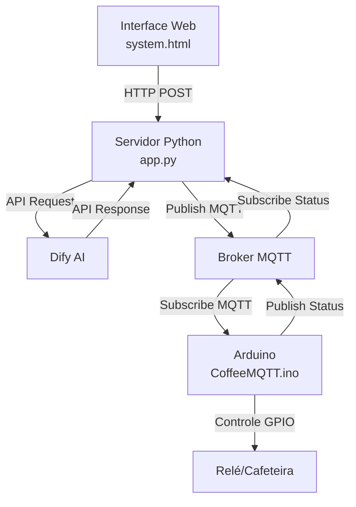

# CoffeeAI Control - Documentação Técnica Completa

## 1. Visão Geral
O CoffeeAI Control é um sistema inteligente de controle de cafeteira que integra IoT, IA conversacional e interface web para proporcionar uma experiência avançada no preparo de café. Combinando hardware e software, o sistema permite controlar uma cafeteira remotamente através de comandos de texto, monitorar seu status em tempo real e receber recomendações personalizadas.

### 1.1 Arquitetura do Sistema

```mermaid
flowchart TD
    A[Interface Web\nsystem.html] -->|HTTP POST| B[Servidor Python\napp.py]
    B -->|API Request| C[Dify AI]
    C -->|API Response| B
    B -->|Publish MQTT| D[Broker MQTT]
    D -->|Subscribe MQTT| E[Arduino\nCoffeeMQTT.ino]
    E -->|Publish Status| D
    D -->|Subscribe Status| B
    E -->|Controle GPIO| F[Relé/Cafeteira]
```

### 1.2 Principais Componentes
- **Frontend**: Interface web responsiva
- **Backend**: Servidor Flask Python
- **IA**: Integração com Dify.ai
- **IoT**: Arduino Uno R4 WiFi
- **Comunicação**: Protocolo MQTT

## 2. Estrutura do Projeto
```
coffee-control/
├── app.py                 # Servidor backend Flask
├── coffee.db              # Banco de dados SQLite
├── requirements.txt       # Dependências Python
├── templates/            
│   ├── system.html        # Interface principal
│   ├── index.html         # Página inicial
│   └── auth.html          # Página de autenticação
├── static/                # Arquivos estáticos (CSS, JS, imagens)
├── arduino/
│   └── CoffeeController/
│       └── CoffeeController.ino # Código do Arduino
└── docs/
    └── architecture.mmd   # Diagrama de arquitetura
```

## 3. Requisitos de Hardware

### 3.1 Componentes Principais
- Arduino Uno R4 WiFi
- Módulo de relé (conectado ao pino 7)
- Sensor de temperatura DS18B20 (opcional, conectado ao pino 4)
- Resistor pull-up de 4.7k ohm para o sensor DS18B20 (se utilizado)
- Cafeteira elétrica
- Computador para executar o servidor Flask e broker MQTT

### 3.2 Diagrama de Conexão
```
Arduino Uno R4 WiFi
┌───────────────────┐
│                   │
│ PIN 7 ────────────┼───> Módulo Relé ───> Cafeteira
│                   │
│ PIN 4 ────────────┼───> DS18B20 (Temp)
│ 5V ───────────────┼───> Alimentação Sensores/Relé
│ GND ──────────────┼───> GND Sensores/Relé
│                   │
└───────────────────┘
```

## 4. Componentes do Sistema

### 4.1 Backend (app.py)
- **Framework**: Flask
- **Funcionalidades**:
  - Gerenciamento de estado da cafeteira
  - Integração com Dify.ai
  - Comunicação MQTT
  - API RESTful
  - Controle de segurança
  - Autenticação de usuários

#### 4.1.1 Rotas API
- `GET /`: Página inicial
- `GET /auth`: Página de autenticação
- `POST /login`: Processamento de login
- `POST /register`: Registro de usuários
- `GET /logout`: Encerramento de sessão
- `GET /system`: Interface principal (protegida)
- `POST /chat`: Processamento de comandos
- `GET /status`: Estado atual da cafeteira
- `GET /guide`: Guia de uso
- `GET /recipes`: Receitas de café
- `GET /brewing-methods`: Métodos de preparo
- `GET /equipment`: Informações de equipamentos
- `GET /maintenance-guide`: Guia de manutenção
- `GET /docs`: Documentação
- `GET /features`: Recursos do sistema

### 4.2 Frontend (system.html)
- **Design**: Interface futurista com efeitos visuais
- **Componentes**:
  - Painel de controle
  - Chat interativo
  - Indicadores de status
  - Medidor de temperatura
  - Comandos rápidos

#### 4.2.1 Recursos Visuais
- Tema escuro com acentos neon
- Efeitos de glassmorphism
- Animações suaves
- Design responsivo
- Indicadores em tempo real

### 4.3 Sistema IoT (Arduino)
- **Hardware**:
  - Arduino Uno R4 WiFi
  - Sensor de temperatura (DS18B20)
  - Módulo relé para controle da cafeteira
  
#### 4.3.1 Funcionalidades IoT
- Controle de liga/desliga
- Monitoramento de temperatura
- Status em tempo real
- Comunicação serial com o servidor

## 5. Instalação e Configuração

### 5.1 Requisitos de Software (macOS)
- Python 3.8+
- Homebrew
- Arduino IDE
- Bibliotecas Arduino: OneWire, DallasTemperature
- Broker MQTT (Mosquitto)

### 5.2 Instalação de Dependências no macOS

#### 5.2.1 Instalar o Homebrew
```bash
/bin/bash -c "$(curl -fsSL https://raw.githubusercontent.com/Homebrew/install/HEAD/install.sh)"
```

#### 5.2.2 Instalar o Python e criar ambiente virtual
```bash
# Instalar Python (se ainda não tiver)
brew install python3

# Criar uma pasta para o projeto
mkdir cafeteira-iot
cd cafeteira-iot

# Criar ambiente virtual
python3 -m venv venv

# Ativar o ambiente virtual
source venv/bin/activate
```

#### 5.2.3 Instalar o Mosquitto (Broker MQTT)
```bash
brew install mosquitto
```

#### 5.2.4 Instalar as dependências Python
```bash
pip install flask flask-cors paho-mqtt requests pyjwt pyserial
```

### 5.3 Configuração do Broker MQTT

#### 5.3.1 Localizar o arquivo de configuração
```bash
# Listar arquivos do Mosquitto
brew list mosquitto
```

#### 5.3.2 Editar o arquivo de configuração
```bash
sudo nano /usr/local/Cellar/mosquitto/2.0.21/etc/mosquitto/mosquitto.conf
```

Adicione estas linhas ao final do arquivo:
```
# Habilitar porta não-padrão
listener 1884

# Permitir conexões sem autenticação (apenas para desenvolvimento)
allow_anonymous true
```

#### 5.3.3 Iniciar o serviço Mosquitto
```bash
# Iniciar o serviço
brew services start mosquitto

# Verificar status
brew services list
```

### 5.4 Código do Arduino

#### 5.4.1 Instalação de bibliotecas Arduino
Abra o Arduino IDE e instale as seguintes bibliotecas:
- OneWire (por Paul Stoffregen)
- DallasTemperature (por Miles Burton)

#### 5.4.1.1 Nota sobre Módulos de Relé
Este projeto utiliza um módulo de relé com lógica invertida (normalmente fechado - NC). Isso significa que:
- O comando LOW ativa o relé (liga a cafeteira)
- O comando HIGH desativa o relé (desliga a cafeteira)

Esta configuração é comum em muitos módulos de relé e atua como um mecanismo de segurança: em caso de falha no sistema ou falta de energia, o dispositivo conectado permanece desligado por padrão.

#### 5.4.2 Código do Arduino
```arduino
/*
 * Coffee Machine Controller for Arduino Uno R4 WiFi
 * Controls a relay connected to pin 7 for turning the coffee machine on/off
 * Responds to serial commands from a Flask application
 * Reads temperature from DS18B20 sensor (if connected)
 */

#include <OneWire.h>
#include <DallasTemperature.h>
#include <WiFiS3.h>  // WiFi library for Arduino Uno R4 WiFi

// Pin Definitions
#define RELE_CAFETEIRA 7  // Coffee machine relay
#define LED_STATUS 2      // Status LED (built-in LED on pin 2)
#define SENSOR_TEMP 4     // Temperature sensor pin

// Configuration
#define SERIAL_BAUD 115200
#define TEMP_CHECK_INTERVAL 2000  // Check temperature every 2 seconds

// System State
bool cafeteiraLigada = false;     // Coffee machine state
float temperature = 25.0;         // Default temperature value
unsigned long lastTempCheck = 0;  // Last temperature reading timestamp
unsigned long lastHeartbeat = 0;  // Last heartbeat timestamp

// Initialize temperature sensor (if connected)
OneWire oneWire(SENSOR_TEMP);
DallasTemperature sensors(&oneWire);
bool sensorConnected = false;     // Flag to track if sensor is connected

void setup() {
  // Initialize pins
  pinMode(RELE_CAFETEIRA, OUTPUT);
  pinMode(LED_STATUS, OUTPUT);
  
  // Set initial state - coffee machine off
  // NOTA: Para relés normalmente fechados (NC), usamos HIGH para desligar
  digitalWrite(RELE_CAFETEIRA, HIGH);
  digitalWrite(LED_STATUS, LOW);
  
  // Start serial communication
  Serial.begin(SERIAL_BAUD);
  while (!Serial && millis() < 3000);  // Wait for serial to connect (with timeout)
  
  // Initialize temperature sensor
  sensors.begin();
  
  // Check if temperature sensor is connected
  sensors.requestTemperatures();
  float tempC = sensors.getTempCByIndex(0);
  if (tempC != DEVICE_DISCONNECTED_C && tempC != -127.00) {
    sensorConnected = true;
    temperature = tempC;
    Serial.println("Temperature sensor detected!");
  } else {
    Serial.println("Temperature sensor not detected. Using simulated values.");
  }
  
  Serial.println("CoffeeAI Control System Ready");
  Serial.println("Available commands:");
  Serial.println("  ping - Check connection");
  Serial.println("  ligar - Turn coffee machine ON");
  Serial.println("  desligar - Turn coffee machine OFF");
  Serial.println("  status - Get system status");
}

void loop() {
  unsigned long currentMillis = millis();
  
  // Read temperature sensor at regular intervals
  if (currentMillis - lastTempCheck >= TEMP_CHECK_INTERVAL) {
    lastTempCheck = currentMillis;
    if (sensorConnected) {
      sensors.requestTemperatures();
      float tempC = sensors.getTempCByIndex(0);
      if (tempC != DEVICE_DISCONNECTED_C && tempC != -127.00) {
        temperature = tempC;
      }
    }
  }
  
  // Send heartbeat
  if (currentMillis - lastHeartbeat >= 1000) {
    lastHeartbeat = currentMillis;
    // Serial.println("heartbeat");  // Uncomment if your Flask app expects heartbeats
  }
  
  // Check for serial commands
  if (Serial.available()) {
    String command = Serial.readStringUntil('\n');
    command.trim();
    
    // Process commands
    if (command == "ping") {
      Serial.println("pong");
    }
    else if (command == "ligar") {
      handleLigarCommand();
    }
    else if (command == "desligar") {
      handleDesligarCommand();
    }
    else if (command == "status") {
      publishStatus();
    }
  }
  
  // Add a small delay to prevent CPU overload
  delay(10);
}

void handleLigarCommand() {
  cafeteiraLigada = true;
  digitalWrite(RELE_CAFETEIRA, LOW);   // Para módulos de relé NC, LOW ativa o relé
  digitalWrite(LED_STATUS, HIGH);
  Serial.println("ok");
  publishStatus();
}

void handleDesligarCommand() {
  cafeteiraLigada = false;
  digitalWrite(RELE_CAFETEIRA, HIGH);  // Para módulos de relé NC, HIGH desativa o relé
  digitalWrite(LED_STATUS, LOW);
  Serial.println("ok");
  publishStatus();
}

void publishStatus() {
  // Create JSON-like status message
  Serial.print("{\"status\":\"");
  Serial.print(cafeteiraLigada ? "ligada" : "desligada");
  Serial.print("\",\"system_status\":\"");
  Serial.print(cafeteiraLigada ? "online" : "offline");
  Serial.print("\",\"temperature\":\"");
  Serial.print(temperature);
  Serial.print("\",\"water_level\":\"100");
  Serial.print("\",\"pressure\":\"9.0");
  Serial.println("\"}");
}
```

## 6. Resolução de Problemas com Portas Seriais

### 6.1 Identificar portas seriais em uso

```bash
# Listar todas as portas seriais
ls /dev/cu.*

# Ver quais processos estão usando uma porta específica
lsof | grep usbmodem
```

### 6.2 Liberar porta serial em uso

Se você encontrar um processo usando a porta serial do Arduino, você pode encerrar esse processo:

```bash
# Encerrar um processo específico
kill [PID]

# Para encerrar todos os processos usando uma porta específica
sudo pkill -f "/dev/cu.usbmodem[SUASERIAL]"
```

## 7. Comunicação

### 7.1 MQTT
- **Broker**: Mosquitto
- **Tópicos**:
  - `cafeteira/comando`: Controle
  - `cafeteira/status`: Estado
  - `cafeteira/heartbeat`: Verificação de conectividade

### 7.2 APIs
- **Dify.ai**:
  - URL: https://api.dify.ai/v1
  - Autenticação: Bearer Token

## 8. Tipos de Café Suportados
1. **Expresso**
   - Temperatura: 92-96°C
   - Tempo: 30 segundos

2. **Cappuccino**
   - Temperatura: 85°C
   - Tempo: 2 minutos

3. **Latte**
   - Temperatura: 85°C
   - Tempo: 2 minutos

4. **Americano**
   - Temperatura: 90°C
   - Tempo: 1 minuto

## 9. Comandos do Sistema

### 9.1 Comandos de Voz/Chat
- "Ligar cafeteira"
- "Desligar cafeteira"
- "Status da cafeteira"
- "Verificar arduino"
- "Temperatura atual"

### 9.2 Comandos Especiais
- `/cafes`: Lista tipos de café
- `/equipamentos`: Info do hardware
- `/manutencao`: Status de manutenção
- `/ajuda`: Lista de comandos

## 10. Executando o Sistema

Siga estas etapas na ordem correta:

### 10.1 Certifique-se que o broker MQTT está rodando

```bash
# Verificar status
brew services list

# Se não estiver rodando, inicie-o
brew services start mosquitto
```

### 10.2 Verificar se a porta serial está disponível
```bash
ls /dev/cu.*
lsof | grep usbmodem
```

Se necessário, libere a porta:
```bash
kill [PID]
```

### 10.3 Executar o servidor Flask
Em um terminal com o ambiente virtual ativado:

```bash
python app.py
```

### 10.4 Testar o sistema
Acesse a interface web em: http://localhost:5000/

## 11. Testando a Comunicação

### 11.1 Testar o MQTT diretamente

Em um novo terminal:

```bash
# Assinar o tópico de status
/usr/local/Cellar/mosquitto/2.0.21/bin/mosquitto_sub -h localhost -p 1884 -t "cafeteira/status"
```

Em outro terminal:

```bash
# Enviar comando de ligar
/usr/local/Cellar/mosquitto/2.0.21/bin/mosquitto_pub -h localhost -p 1884 -t "cafeteira/comando" -m "ligar"
```

### 11.2 Verificar logs do Flask
Observe o terminal onde o Flask está em execução para ver as mensagens de log e verificar se as requisições estão sendo processadas.

## 12. Manutenção

### 12.1 Monitoramento
- Temperatura ideal: 85-96°C
- Nível de água mínimo: 20%
- Limpeza periódica: 15 dias

### 12.2 Rotina de Manutenção Diária
1. Limpeza do porta-filtro
2. Esvaziamento da bandeja de resíduos
3. Verificação do nível de água
4. Limpeza do vaporizador (se aplicável)

### 12.3 Rotina de Manutenção Semanal
1. Backflush com detergente
2. Limpeza do grupo
3. Descarga do sistema
4. Limpeza de filtros

### 12.4 Rotina de Manutenção Mensal
1. Descalcificação completa
2. Troca de filtros
3. Verificação de componentes
4. Calibração de sensores

### 12.5 Alertas
- Temperatura elevada
- Nível baixo de água
- Necessidade de manutenção

## 13. Segurança
- Autenticação JWT para usuários
- Comunicação MQTT local
- Validação de comandos
- Controle de estado

## 14. Solução de Problemas

### 14.1 Problema: Erro "No module named 'serial.tools'"
**Solução:**
```bash
pip install pyserial
```

### 14.2 Problema: "Resource busy: '/dev/cu.usbmodem[SUASERIAL]'"
**Solução:**
1. Identifique o processo que está usando a porta:
   ```bash
   lsof | grep usbmodem
   ```
2. Encerre o processo:
   ```bash
   kill [PID]
   ```

### 14.3 Problema: Arduino não responde aos comandos
**Solução:**
1. Verifique se a taxa de baud (115200) está correta no código Flask e no Arduino
2. Verifique as conexões do relé (pino 7)
3. Certifique-se de que o Arduino recebeu o código corretamente

### 14.4 Problema: MQTT não conecta
**Solução:**
1. Verifique se o serviço está rodando:
   ```bash
   brew services list
   ```
2. Verifique se a porta configurada está correta (1884)
3. Teste a conexão com ferramentas de linha de comando:
   ```bash
   /usr/local/Cellar/mosquitto/2.0.21/bin/mosquitto_sub -h localhost -p 1884 -t "test"
   ```

### 14.5 Problema: Status inconsistente
**Solução:**
1. Reinicie o servidor Flask
2. Verifique a conexão do Arduino
3. Monitore os tópicos MQTT

### 14.6 Problema: Conflito entre ferramentas ao atualizar o Arduino
**Solução:**
1. Para atualizar o código Arduino, siga esta ordem exata:
   - Encerre o aplicativo Flask com Ctrl+C
   - Feche o VSCode ou qualquer editor que possa estar tentando acessar a porta serial
   - Abra o software Arduino IDE
   - Edite e verifique o código
   - Faça o upload para a placa Arduino
   - Feche completamente o software Arduino IDE
   - Abra o VSCode (ou seu editor preferido)
   - Inicie o servidor Flask novamente

Esta sequência evita conflitos de acesso à porta serial entre as diferentes ferramentas.

## 15. Desenvolvimento e Tecnologias

### 15.1 Tecnologias Utilizadas
- **Backend**: Python, Flask, SQLite
- **Frontend**: HTML5, CSS3, JavaScript
- **IoT**: Arduino, C++
- **Comunicação**: MQTT (Mosquitto)
- **IA**: Integração com Dify.ai

### 15.2 Estrutura de Banco de Dados
SQLite com as seguintes tabelas:
- `users`: Gerenciamento de usuários
- `coffee_logs`: Registro de operações

## 16. Melhorias Futuras
1. Implementação de autenticação avançada
2. Histórico detalhado de preparos
3. Integração com assistentes de voz (Alexa, Google Assistant)
4. Aplicativo móvel nativo
5. Análise de consumo e padrões de uso
6. Recursos de personalização de receitas
7. Suporte a múltiplos dispositivos IoT
8. Integração com plataformas de smart home

---

Esta documentação é um guia completo para configuração, uso e manutenção do sistema CoffeeAI Control. Para questões ou problemas específicos, consulte a documentação oficial das bibliotecas utilizadas ou entre em contato com a equipe de suporte.