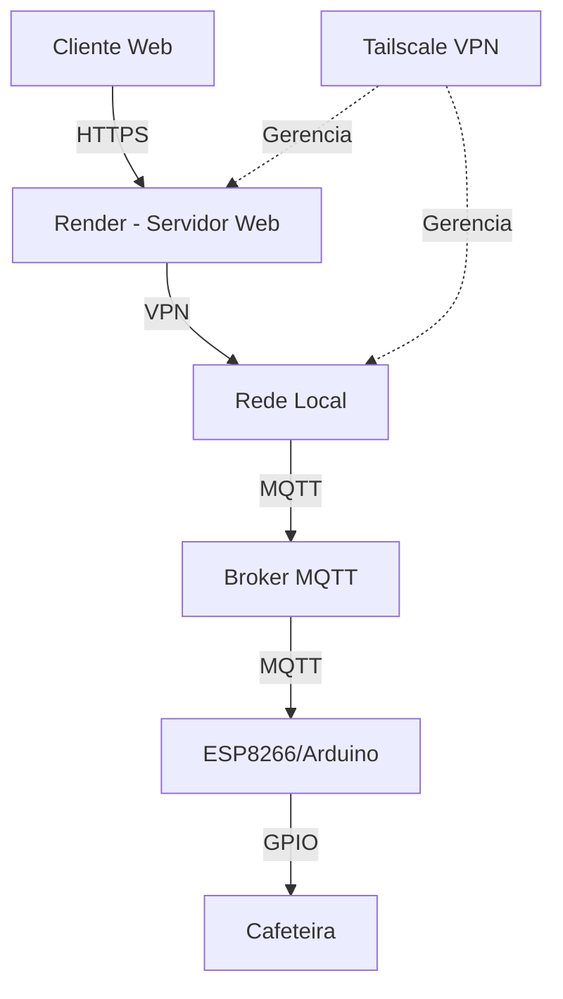

# Documentação de Deploy e Configuração de Rede
## CoffeeAI Control - Sistema IoT de Cafeteira

## 1. Visão Geral

### 1.1 Arquitetura de Rede


### 1.2 Componentes do Sistema
- **Frontend**: Interface web hospedada no Render
- **Backend**: Servidor Flask no Render
- **VPN**: Tailscale/OpenVPN para acesso seguro
- **MQTT**: Broker Mosquitto local
- **IoT**: ESP8266 na rede local

## 2. Preparação para Deploy

### 2.1 Estrutura de Arquivos
```plaintext
coffee-control/
├── app.py                 # Servidor Flask
├── requirements.txt       # Dependências Python
├── Dockerfile            # Configuração Docker
├── render.yaml           # Configuração Render
├── gunicorn.conf.py      # Configuração Gunicorn
├── .env                  # Variáveis de ambiente
├── templates/            # Frontend
│   └── index.html
└── scripts/             # Scripts de deploy
    ├── setup-vpn.sh
    └── setup-mqtt.sh
```

### 2.2 Arquivos de Configuração

#### requirements.txt
```txt
Flask==3.0.0
flask-cors==4.0.0
requests==2.31.0
paho-mqtt==1.6.1
python-dotenv==1.0.0
gunicorn==20.1.0
cryptography==41.0.0
```

#### Dockerfile
```dockerfile
FROM python:3.9-slim

WORKDIR /app

# Instalar dependências
COPY requirements.txt .
RUN pip install --no-cache-dir -r requirements.txt

# Copiar aplicação
COPY . .

# Configurar ambiente
ENV FLASK_APP=app.py
ENV FLASK_ENV=production

# Iniciar com Gunicorn
CMD ["gunicorn", "--config", "gunicorn.conf.py", "app:app"]
```

#### render.yaml
```yaml
services:
  - type: web
    name: coffee-control
    env: python
    buildCommand: pip install -r requirements.txt
    startCommand: gunicorn app:app
    envVars:
      - key: ALLOWED_IPS
        sync: false
      - key: MQTT_BROKER
        sync: false
      - key: MQTT_PORT
        sync: false
      - key: DIFY_API_KEY
        sync: false
```

## 3. Configuração da VPN

### 3.1 Instalação do Tailscale
```bash
# No servidor
curl -fsSL https://tailscale.com/install.sh | sh
tailscale up

# Nos clientes
# Windows/Mac: Baixar instalador do site
# Linux:
curl -fsSL https://tailscale.com/install.sh | sh
tailscale up
```

### 3.2 Configuração da Rede VPN
```bash
# Configurar políticas de ACL
cat > tailscale-acl.json << EOF
{
  "acls": [
    {
      "action": "accept",
      "users": ["*"],
      "ports": ["*:443", "*:1883"]
    }
  ],
  "tagOwners": {
    "tag:coffee": ["autogroup:admin"],
  }
}
EOF

# Aplicar ACL
tailscale set --auto-update --accept-routes --accept-dns=false
```

## 4. Configuração do MQTT

### 4.1 Instalação do Mosquitto
```bash
# Ubuntu/Debian
sudo apt-get update
sudo apt-get install mosquitto mosquitto-clients

# Arch Linux
sudo pacman -S mosquitto
```

### 4.2 Configuração do Broker
```conf
# /etc/mosquitto/mosquitto.conf
listener 1883 localhost
allow_anonymous false
password_file /etc/mosquitto/passwd

# Configurar TLS/SSL
listener 8883
certfile /etc/mosquitto/certs/server.crt
keyfile /etc/mosquitto/certs/server.key
cafile /etc/mosquitto/ca_certificates/ca.crt
```

### 4.3 Segurança MQTT
```bash
# Criar usuário
sudo mosquitto_passwd -c /etc/mosquitto/passwd coffee_user

# Gerar certificados
openssl req -new -x509 -days 365 -extensions v3_ca -keyout ca.key -out ca.crt
openssl genrsa -out server.key 2048
openssl req -out server.csr -key server.key -new
openssl x509 -req -in server.csr -CA ca.crt -CAkey ca.key -CAcreateserial -out server.crt -days 365
```

## 5. Deploy no Render

### 5.1 Preparação
1. Criar conta no Render
2. Conectar repositório Git
3. Configurar variáveis de ambiente:
   - `ALLOWED_IPS`
   - `MQTT_BROKER`
   - `MQTT_PORT`
   - `DIFY_API_KEY`

### 5.2 Deploy
```bash
# Push para o repositório
git add .
git commit -m "Deploy CoffeeAI Control"
git push origin main

# O Render fará o deploy automaticamente
```

## 6. Segurança

### 6.1 Firewall
```bash
# Configurar UFW
sudo ufw allow from 192.168.1.0/24 to any port 1883 # MQTT
sudo ufw allow from 192.168.1.0/24 to any port 443  # HTTPS
```

### 6.2 SSL/TLS
```bash
# Gerar certificado SSL
openssl req -x509 -nodes -days 365 -newkey rsa:2048 \
  -keyout private.key -out certificate.crt

# Configurar no Flask
ssl_context = ('certificate.crt', 'private.key')
```

## 7. Monitoramento

### 7.1 Logs
```bash
# Logs do aplicativo
tail -f /var/log/coffee-control.log

# Logs MQTT
tail -f /var/log/mosquitto/mosquitto.log

# Logs VPN
tailscale netcheck
```

### 7.2 Status do Sistema
```bash
# Status dos serviços
systemctl status mosquitto
systemctl status tailscaled

# Monitorar MQTT
mosquitto_sub -v -t "cafeteira/#"
```

## 8. Troubleshooting

### 8.1 Problemas Comuns

1. **Erro de Conexão MQTT**
   ```bash
   # Verificar broker
   netstat -an | grep 1883
   # Verificar logs
   tail -f /var/log/mosquitto/mosquitto.log
   ```

2. **Problemas de VPN**
   ```bash
   # Verificar status
   tailscale status
   # Debug
   tailscale debug
   ```

3. **Erros de Certificado**
   ```bash
   # Verificar certificados
   openssl x509 -in certificate.crt -text -noout
   ```

### 8.2 Comandos Úteis
```bash
# Testar MQTT
mosquitto_pub -h localhost -t test -m "test message"
mosquitto_sub -h localhost -t test

# Verificar rede
ping mqtt.local
netstat -tulpn

# Verificar logs
journalctl -u mosquitto -f
journalctl -u tailscaled -f
```

## 9. Manutenção

### 9.1 Backups
```bash
# Backup configurações
tar -czf coffee-control-config.tar.gz \
    /etc/mosquitto/mosquitto.conf \
    /etc/mosquitto/passwd \
    /etc/tailscale/
```

### 9.2 Atualizações
```bash
# Atualizar sistema
sudo apt update && sudo apt upgrade

# Atualizar dependências Python
pip install -r requirements.txt --upgrade

# Atualizar Tailscale
tailscale update
```

Precisa de mais detalhes em alguma seção específica?