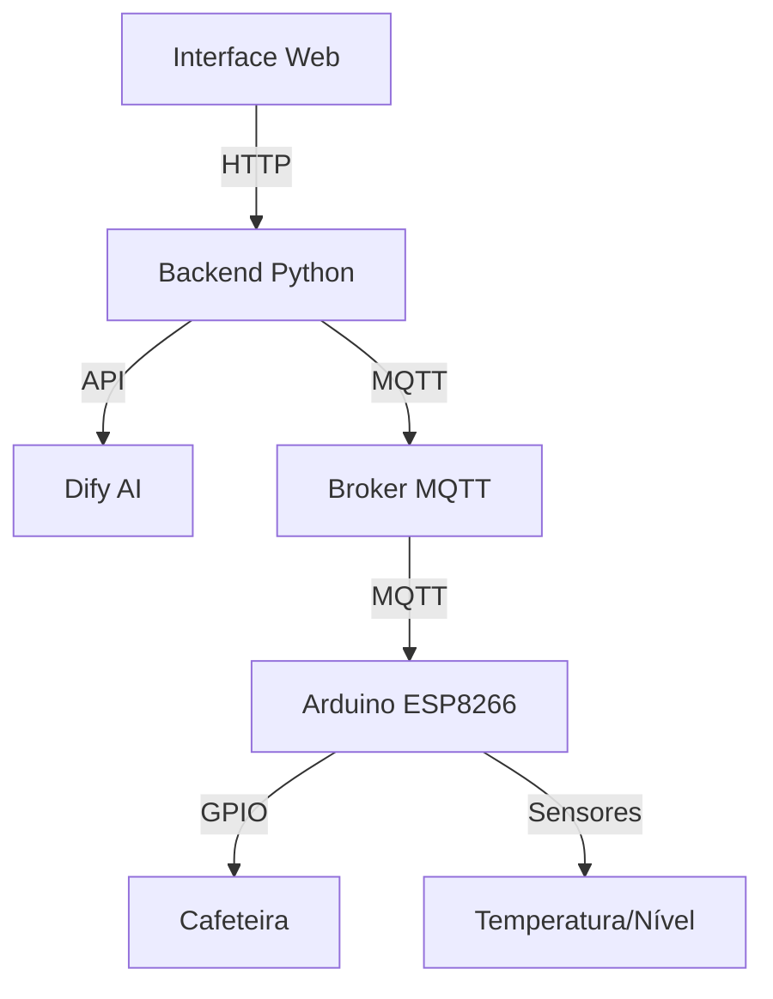

# CoffeeAI Control - Sistema Inteligente de Cafeteria
## Documentação Completa do Sistema

## 1. Visão Geral do Sistema

### 1.1 Introdução
O CoffeeAI Control é um sistema IoT avançado que integra:
- Controle inteligente de cafeteira
- Interface web interativa
- Chatbot com IA
- Monitoramento em tempo real
- Automação via Arduino

### 1.2 Arquitetura do Sistema


## 2. Componentes Principais

### 2.1 Frontend (Interface Web)
- **Tecnologias**: HTML5, CSS3, JavaScript
- **Design**: Futurista e responsivo
- **Features**:
  - Chat integrado
  - Painel de controle
  - Monitoramento em tempo real
  - Comandos rápidos

### 2.2 Backend (Python/Flask)
- **Tecnologias**: Flask, MQTT, Requests
- **APIs**:
  - Dify.ai para processamento de linguagem natural
  - MQTT para comunicação IoT
  - RESTful para interface web

### 2.3 Arduino (IoT)
- **Hardware**:
  - ESP8266
  - Sensor DS18B20 (temperatura)
  - Sensor de nível
  - Módulo relé
  - Display OLED (opcional)

### 2.4 IA/Chatbot
- **Plataforma**: Dify.ai
- **Recursos**:
  - Processamento de linguagem natural
  - Recomendações personalizadas
  - Análise de contexto
  - Respostas dinâmicas

## 3. Funcionalidades Detalhadas

### 3.1 Controle da Cafeteira
```python
# Exemplo de comando via MQTT
mqtt_client.publish("cafeteira/comando", {
    "action": "ligar",
    "type": "expresso",
    "temperature": 94,
    "time": 30
})
```

#### Comandos Disponíveis:
1. **Ligar Cafeteira**
   - Via chat: "Ligar cafeteira para expresso"
   - Via botão: Interface web
   - Retorno: Status e temperatura

2. **Desligar Cafeteira**
   - Comando manual
   - Desligamento automático
   - Feedback de status

3. **Monitoramento**
   - Temperatura em tempo real
   - Nível de água
   - Tempo de preparo
   - Status do sistema

### 3.2 Interface Web

#### 3.2.1 Layout Principal
```html
<div class="container">
    <!-- Painel de Controle -->
    <div class="control-panel">
        <button class="power-on">Ligar</button>
        <button class="power-off">Desligar</button>
    </div>

    <!-- Monitor de Status -->
    <div class="status-panel">
        <div class="temperature">94°C</div>
        <div class="water-level">80%</div>
    </div>

    <!-- Chat Interface -->
    <div class="chat-container">
        <!-- Mensagens -->
    </div>
</div>
```

#### 3.2.2 Monitoramento em Tempo Real
```javascript
function updateStatus() {
    fetch('/status')
        .then(response => response.json())
        .then(data => {
            updateTemperature(data.temperature);
            updateWaterLevel(data.water_level);
            updateSystemStatus(data.status);
        });
}
```

### 3.3 Arduino/ESP8266

#### 3.3.1 Código Principal
```cpp
#include <ESP8266WiFi.h>
#include <PubSubClient.h>
#include <ArduinoJson.h>
#include <OneWire.h>
#include <DallasTemperature.h>

// Pinos
const int RELE_CAFETEIRA = D1;
const int SENSOR_TEMP = D2;
const int SENSOR_NIVEL = D3;

// Sensores
OneWire oneWire(SENSOR_TEMP);
DallasTemperature sensors(&oneWire);

void setup() {
    pinMode(RELE_CAFETEIRA, OUTPUT);
    sensors.begin();
    setupWiFi();
    setupMQTT();
}

void loop() {
    if (!mqtt.connected()) {
        reconnect();
    }
    mqtt.loop();
    
    // Leitura de sensores
    sensors.requestTemperatures();
    float temp = sensors.getTempCByIndex(0);
    int nivel = analogRead(SENSOR_NIVEL);
    
    // Publicar status
    publishStatus(temp, nivel);
    
    delay(1000);
}
```

### 3.4 Integração com IA (Dify)

#### 3.4.1 Processamento de Comandos
```python
def process_command(message):
    """Processa comandos do usuário via Dify"""
    response = requests.post(
        f"{DIFY_API_URL}/chat-messages",
        headers={
            'Authorization': f'Bearer {DIFY_API_KEY}',
            'Content-Type': 'application/json'
        },
        json={
            'query': message,
            'response_mode': "blocking"
        }
    )
    return handle_dify_response(response.json())
```

#### 3.4.2 Tipos de Interação
1. **Comandos Diretos**
   - Ligar/Desligar
   - Status
   - Temperatura

2. **Perguntas sobre Café**
   - Tipos disponíveis
   - Métodos de preparo
   - Dicas

3. **Suporte Técnico**
   - Problemas comuns
   - Manutenção
   - Calibração

## 4. Segurança e Manutenção

### 4.1 Segurança
- Comunicação MQTT criptografada
- Validação de comandos
- Monitoramento de temperatura
- Proteção contra sobrecarga

### 4.2 Manutenção
```python
def check_maintenance():
    return {
        "last_maintenance": last_maintenance_date,
        "next_maintenance": calculate_next_maintenance(),
        "cleaning_needed": check_cleaning_status(),
        "descaling_needed": check_descaling_status()
    }
```

## 5. Instalação e Configuração

### 5.1 Requisitos
```bash
# Backend
pip install -r requirements.txt

# MQTT Broker
sudo pacman -S mosquitto  # Arch Linux
# ou
sudo apt-get install mosquitto  # Ubuntu
```

### 5.2 Configuração Arduino
1. Instalar bibliotecas:
   - ESP8266WiFi
   - PubSubClient
   - ArduinoJson
   - OneWire
   - DallasTemperature

2. Configurar WiFi e MQTT:
   ```cpp
   const char* ssid = "seu_wifi";
   const char* password = "sua_senha";
   const char* mqtt_server = "seu_broker";
   ```

### 5.3 Configuração Backend
1. Configurar variáveis:
   ```python
   DIFY_API_KEY = 'sua_chave'
   MQTT_BROKER = 'localhost'
   MQTT_PORT = 1883
   ```

2. Iniciar serviços:
   ```bash
   sudo systemctl start mosquitto
   python app.py
   ```

## 6. Troubleshooting

### 6.1 Problemas Comuns
1. **Erro de Conexão MQTT**
   - Verificar broker
   - Checar portas
   - Testar rede

2. **Temperatura Incorreta**
   - Calibrar sensor
   - Verificar conexões
   - Atualizar firmware

3. **Chatbot Não Responde**
   - Verificar API key
   - Testar conexão
   - Logs do servidor

## 7. Desenvolvimento Futuro

### 7.1 Melhorias Planejadas
1. Autenticação de usuários
2. App mobile
3. Mais tipos de café
4. Machine Learning para preferências
5. Integração com smart home